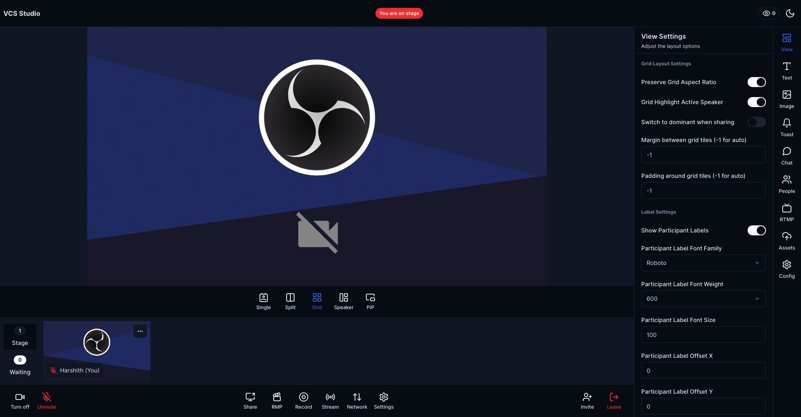

# Daily Studio

Create a custom live and recorded experience with Daily's Video Component System (VCS) and Interactive Live Streaming (ILS)

## Features

- Interactive Live Streaming ([ILS](https://www.daily.co/products/interactive-live-streaming)), supports three roles.
  - Owner - The owner of the stream, can invite participants to join the stream, customize the layout.
  - Presenter - The presenter of the stream, can share their camera, screen, and audio.
  - Viewer - The viewer of the stream, can only view the stream.
- Stream to multiple platforms at once (e.g. YouTube, Twitch, Facebook, etc.)
- Record your stream
- Customizable Stream UI with VCS
- Invite participants to join your stream
- Chat with participants
- Remote Media Player

### Live example

**[See it in action here ➡️](https://daily-studio.vercel.app/)**

## Getting Started

### Install dependencies

```
yarn install
```

### Copy & update the env variables

```
# set DAILY_API_KEY, NEXT_PUBLIC_DAILY_DOMAIN & NEXT_PUBLIC_BASE_URL
cp env.example .env.local
```

### Start your dev server

```
yarn dev
```

Demo should be live at - http://localhost:3000

## Deploy your own on Vercel

[](https://vercel.com/new/clone-flow?repository-url=https%3A%2F%2Fgithub.com%2Fdaily-solutions%daily-studio.git&env=NEXT_PUBLIC_DAILY_DOMAIN%2CNEXT_PUBLIC_BASE_URL%2CDAILY_API_KEY)
